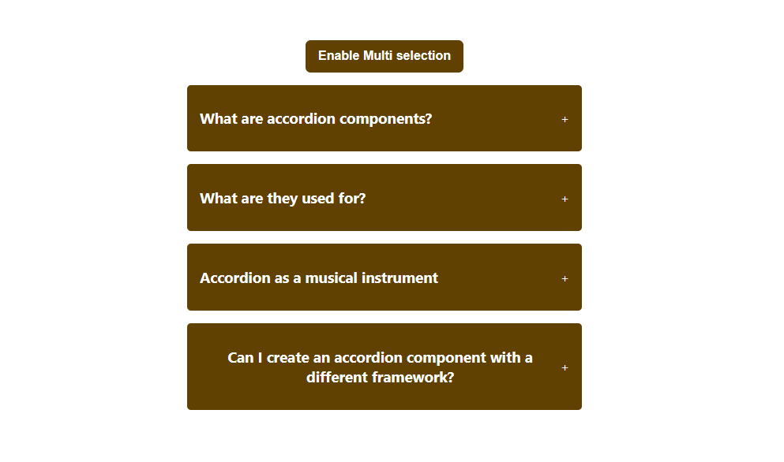
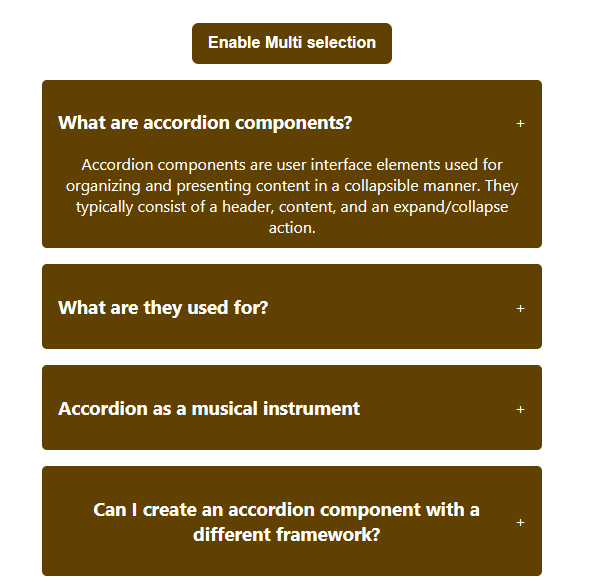
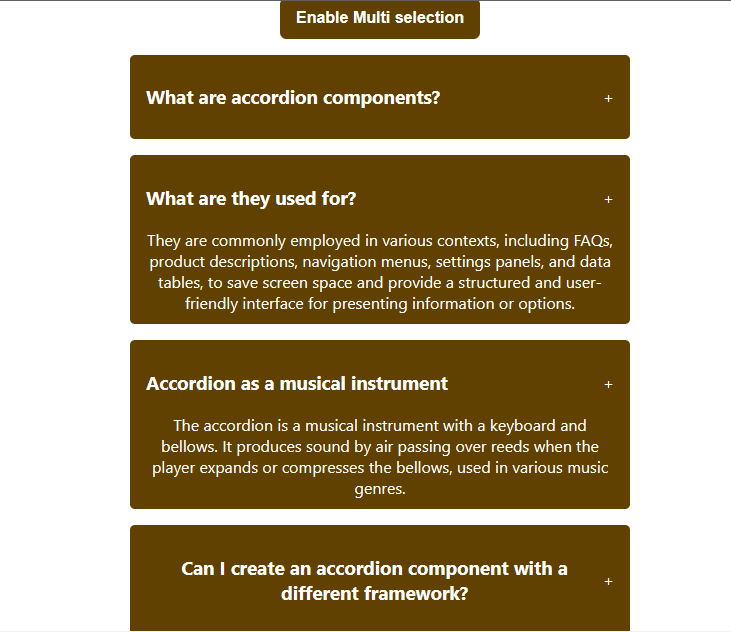

# Accordion Project using react

## Description :

Accordion project basically means if user clicks a item it open it's description or answer like hidden information.

Here I implemented the single question accordion as well as multi question accordion.

difference between these two are in single question mode only show the answer of user clicked question, if user clicks another question it shows only respective answer, But hides remaining on contrary multi mode show whatever answer user clicks it hides only if user clicks that question same again.

## Index page :

## Single selection mode :

## Multi selection mode :

