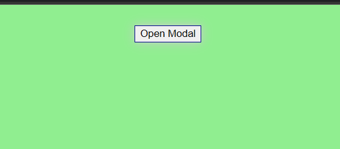
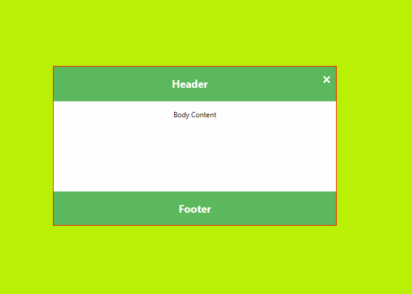

# Modal Project using react

## Description :

Modal project used to provide a behaviour of dynamic Modal content show based on user clicked a button.

Here I implemented the Modal Project using business logic of parent component `ModalTest` passing prop values includes `header`, `body` and `footer`.

On child component we pass those values to the corresponding fields. If user doesn't pass prop values it automatically access the defalut values. When user clicks the modal close button modal will close and show the toggle button.

Whenever user enters the webpage it initially shows the open modal button only. if user clicks it it trigger the show modal state and render the modal ui on the web page.

## Index page :

## Modal Page

