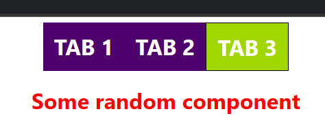

# Tabs Project using react

## Description :

Tabs project used to provide a behaviour of dynamic tab content show based on clicked tabs.

Here I implemented the Tabs Project using business logic of parent component `TabTest` passing prop values includes tabs `label` and `content`

On child component we map through the each and every tab item and position its label and content render through the UI. Content render only if the `currentTabIndex` value and index of the `tab` value is same.

Whenever user clicks the another tabs it invoke the `handleOnClick` function to change the current index aka `currentTabIndex` state value. It ensures only current tab can contain the classname of acitve, So that we can differentiate it from another tabs in ui.

## TAB 1 page :

## TAB 2 page :

## TAB 3 page

