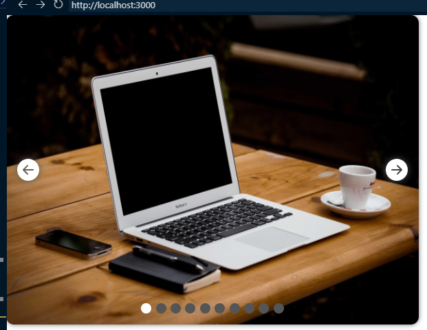
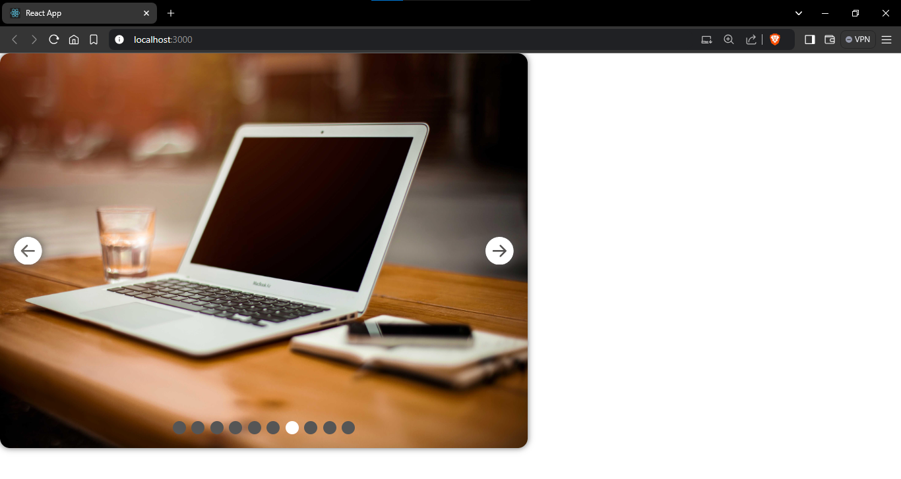

# Image Slider Project using react

## Description :

Image Slider project uses to provide a behaviour of image sliding or gallery view.

Here I implemented the image sliding via `API`.

If api endpoint doesn't exist it throws an error, It it fetches image urls from API endpoint then convert into valid json data
finally id data is valid then map through all images and provides the slider effect using css.

Whenever user clicks the right arrow it move next image as well as left arrow functionally opposit direction(previous image). Also user can navigate through indicator to specific index of images. It follows the looping functionality to infinite slides

## Initial page :

## Hovering And Clicked Page :

##

