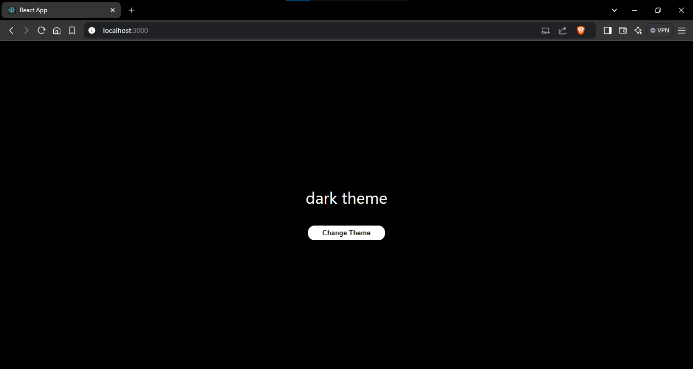
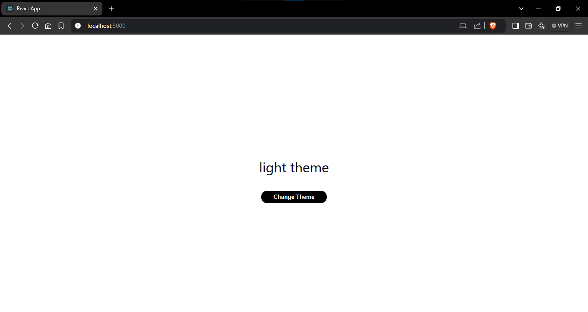

# Light Dark Mode Project using react

## Description :

Light Dark Mode project displays a basic functionality of light or dark theme by user choice.

Here I implemented the Light Dark Mode with if user clicks a button(`Change Theme`) it's check its current theme from local storage and change to opposite theme

Also here i used a custom theme named `useLocalStorage` to automate the process of checking and changing the theme from current state

## Dark Theme :

## Light Theme :

