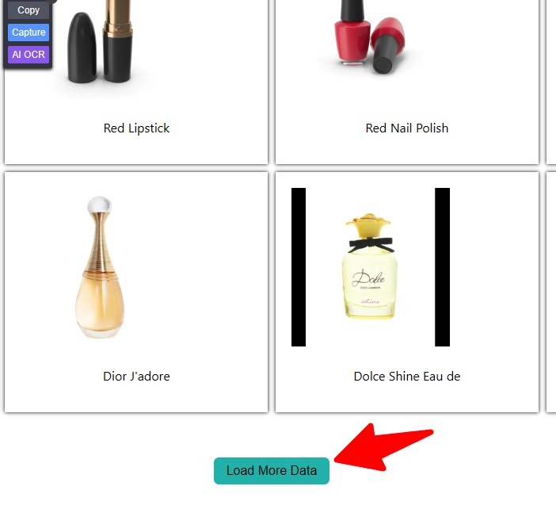

# Load More Data Project using react

## Description :

Load More Data project displays a functionality of load next or more details data on the web page.

Here I implemented the Intial skeleton only with 10 products. Whenever user clicks the load more data button it triggers the fetchdata function to get next 10 products in the `API` endpoint.

## Disclaimer

Here i use the [dummyjson.com]("https://dummyjson.com/products?limit=10&skip=10") api endpoint. if you want to change the intial no of data or skip no of item you can modify it by `URL` limit = (no of products) and skip = (no of prodcts to be skipped), Also as usually i used the Loading functionality while fetching products from endpoints

## Initial page :

## Button :

## After Loading State :

