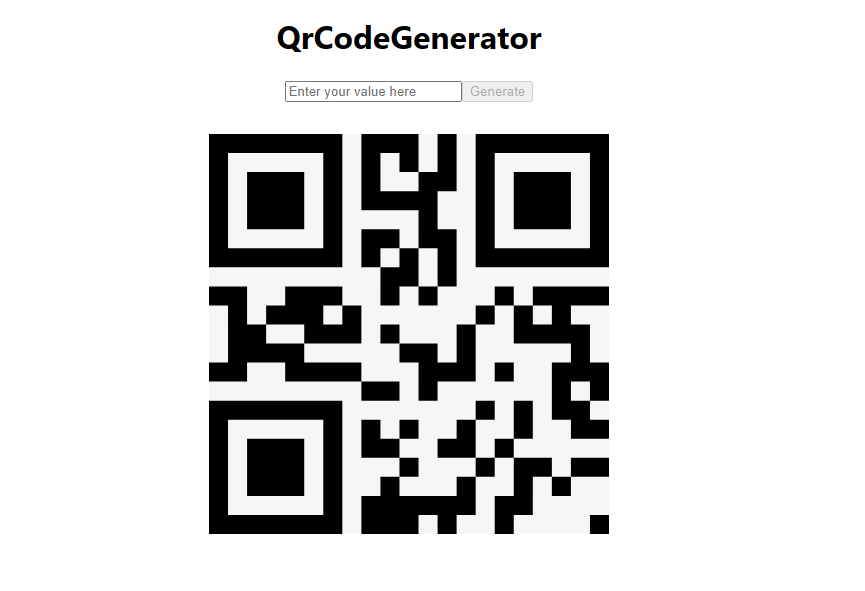

# Qr Code Generator Project using react

## Description :

QrCode Generator project uses to generate a `QR CODE` based on the whatever user input were given.

Here I implemented the QrCode Generator web page using third party library `react-qr-code` npm library package. This allows me to just change its props (value) property to assign the value it gives me an entire QRcode image instantly.

We can additionaly send multiple props this Component like size of the qr code, here iam using 400px and bg of the qr code. We can modify as much as we can.

Initially user input tag was empty also generate button were disabled whenever user enters any data into the input field it changes out state value , finally user clicks the `Generate` button it shows corresponding QRCODE instantly, it was very quick and accurate, After that user can easily capture the qr code to verufy their data.There is no limit, User can generates as much as they can generate different qrcodes.

## Index page :

## Qr Code Generated Page :

