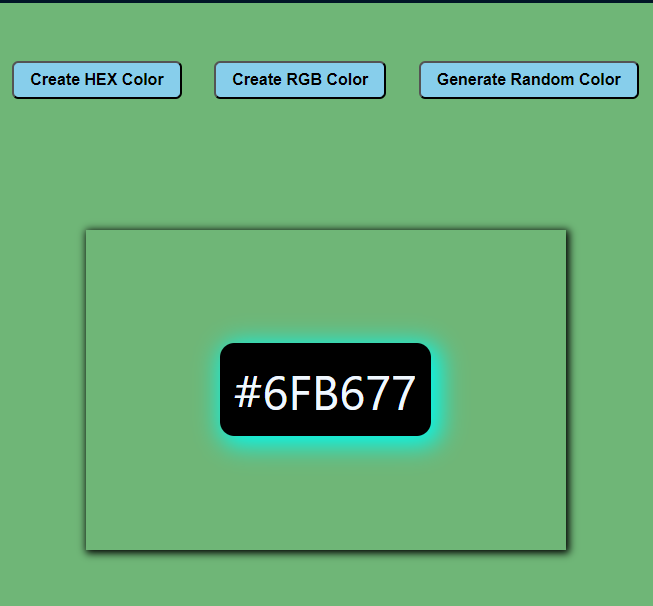
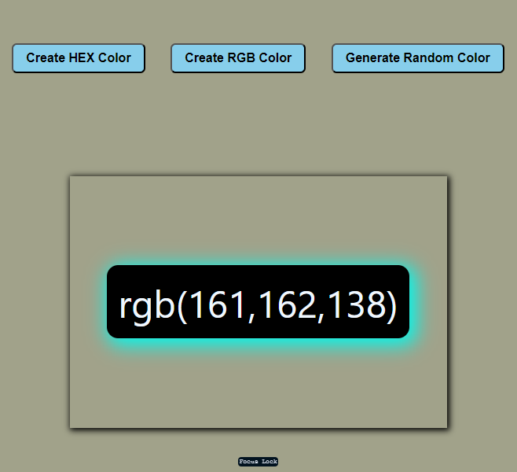

# Random Color Generator Project using react

## Description :

Random Color Generator project uses to generate a random `HEX` color or `RGB` color codes.

Here I implemented the random `HEX` color or `RGB` color code generator website.

difference between these two are `HEX` color codes format of `#000000`, It prefixed with pound symbol then 6numeric or alphabetic letters[a-f] and `RGB` color codes are prefixed with rgb(red, green, blue) combination provides unique colors.

if user clicks create hex color button then it change its mode to hex color like also rgb then if user click `Generate Random Color` button it generates the random color.

There is no limit, User can generates as much as they can generate different color codes

## Index page :

## HEX color mode :

## RGB color mode :

