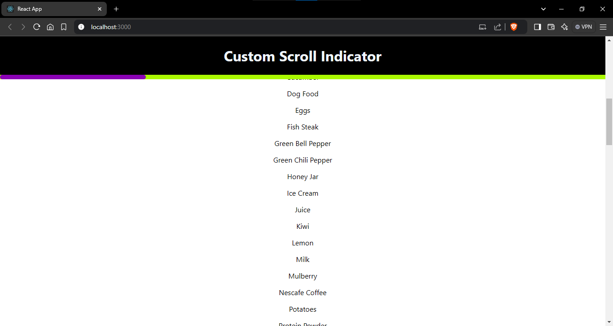

# Scroll Indicator Project using react

## Description :

Scroll Indicator project uses to provide a status of how much user will scroll down or up the web page.

Here I implemented the Scroll Indicator project for sake of scroll behavior i used an some amount of json data, Then using css to provide the scroll status behavior website.

Here I used a formula for calculating scroll percentage is

`howMuchScrolled = document.body.scrollTop || document.documentElement.scrollTop`

It provides how much height user travelled

`height = document.documentElement.scrollHeight - document.documentElement.clientHeight`

It provides the information about how much height distribution of website

Finally we can subtract them both to get a integer value of progress then multiply with 100 to get an percentage value

`setScrollPercentage( ( howMuchScrolled / height ) * 100 )`

Whenever user scrolls the web page scrollbar automatically changes its width to provide % of user scrolled.

## Index page :

## Scrolled Behavior :

