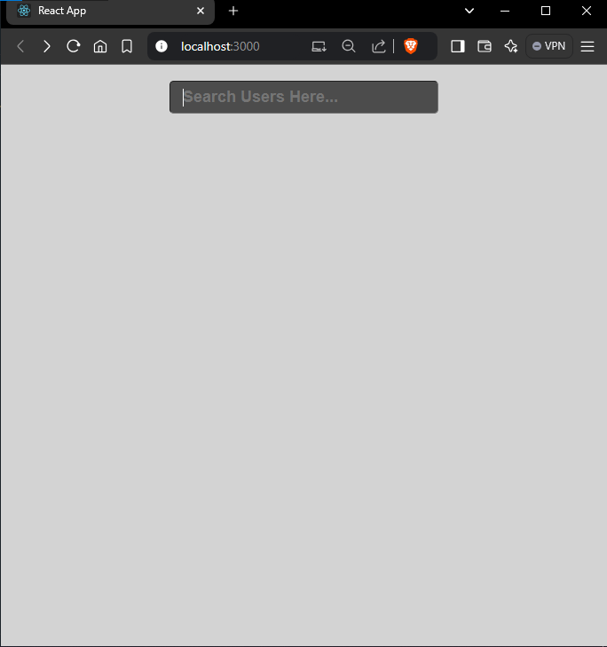
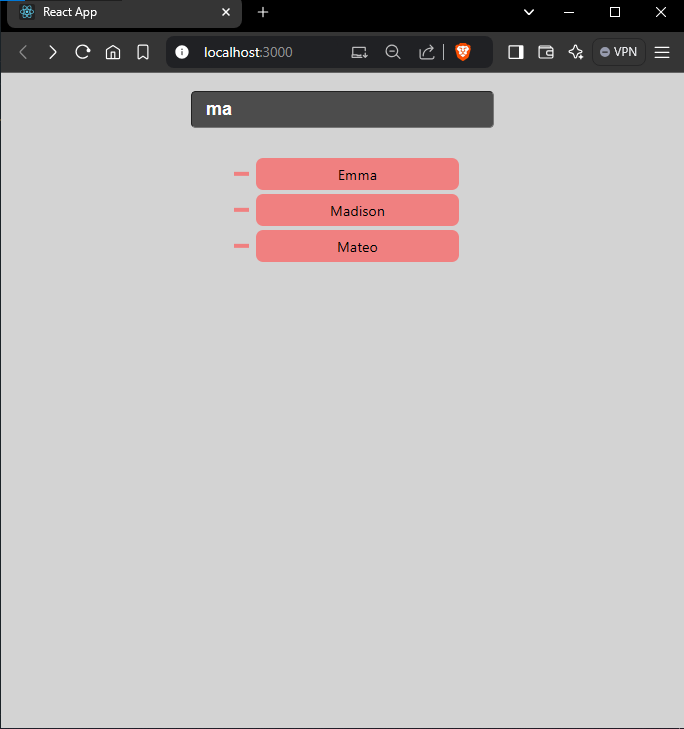

# Search Auto Complete Project using react

## Description :

Search Auto Complete project used to provide a behaviour of dynamic search functionality with a suggestions and autocomplete based on user typed username.

Here I implemented the Search Auto Complete Project using business logic of parent component `SearchAutoComplete` takses an username as a input value then fetch the necessary details from :

> ` `https://dummyjson.com/users` `

then store these values as state value then storing these users first name values in another state called `searchParam`. When user types atleast 2 character then the filter functionality will work. It basically filter the matching character from api users first name and user typed value, During that time web page initiate the loading state to render Loading... on ui.

These filtered user names passed user values as prop to child component. On child component {`Suggestions`} we extract the values like {`data, handleClick`} then use this to provide required list of suggestions on Ui page finally render it.

Whenever user types or changes username it filters and mathces the username then setState of searchParam then send to suggestion component. when user clicks any suggestion it autocompletes the input field.

## Initial State :

## Suggestion State:

