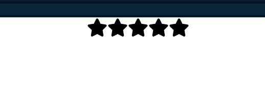
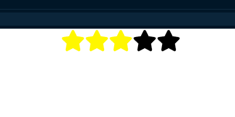

# Star Rating Project using react

## Description :

Star Rating project uses to provide a behaviour of user star rating.

Here I implemented the initial star state, hovering state and final aka(clicked)star state.

Difference between these three are whenever user hover over or mouse over the star it get changes it's color to active state and instead of reverse (decreasing manner) clicked state remain user selected star never decrese unless clicks on lower level.

## Initial page :

## Hovering And Clicked Page :

