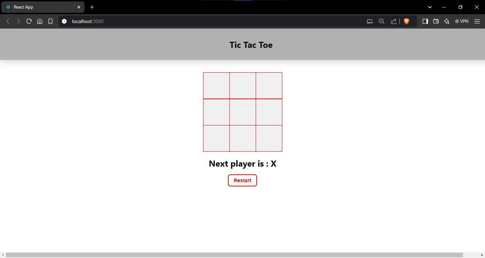
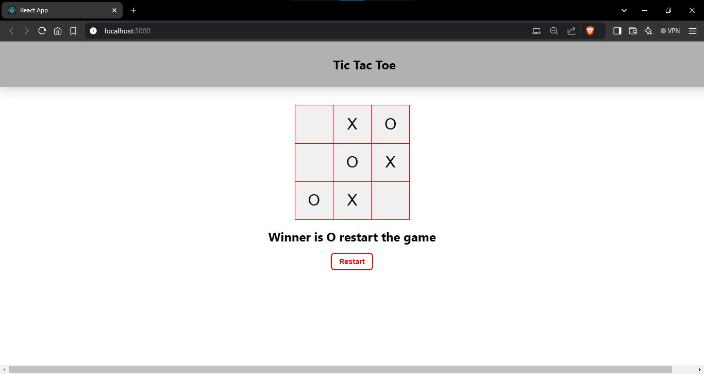
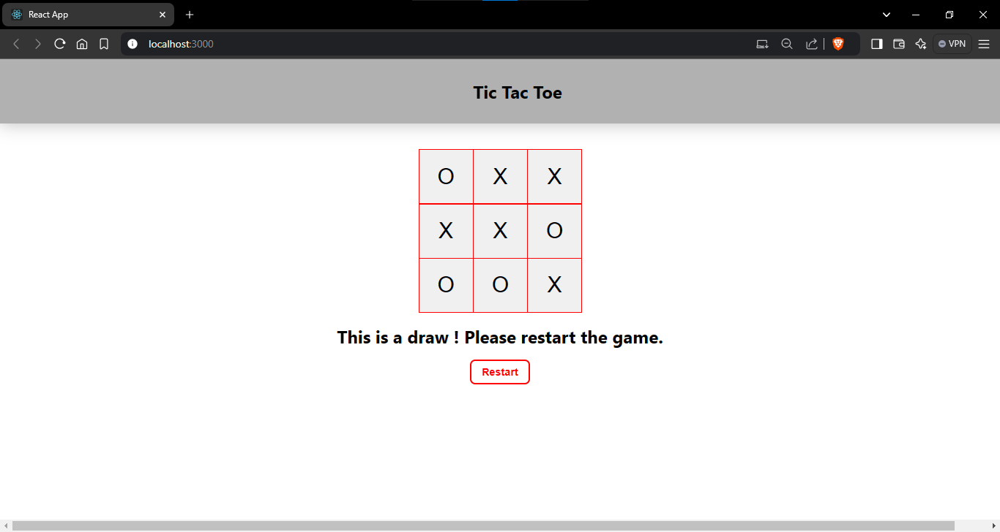

# Tic-Tac-Toe Project using react

## Description :

Tic-Tac-Toe project used to provide a behaviour of a game called `Tic-Tac-Toe`.

Here I implemented the Tic-Tac-Toe Project by two player mode game, Either one can choose `X` or `O` atlast who get the same pattern are the one who is winner

For implementing this project i choose to use 3 row div's with each have 3 `sqaure` child componenet it basically return the `button` tag with props value: either x or o. I used a state value called `isXTurn` to provide each chance to both , Whenever user clicks the box it mark its place their sigil x or o using functionality index of the squre will be identified in the basic array then change its value to user sigil.

For to win either one have to achieve the winning pattern of same row, same column and diagonal column,
whoever gets this pattern first will be winner then square values cannot be changed system asks user to restart the game. If no one has achieved the winning pattern it after all moves system tells to the user `This is draw! Please restart the game`.Atlast whenever user clicks `restart` button system reset the basic array to all empty values it shows blank on UI.

## Initial State :

## Winner X State:

## Winner O State:

## Draw State:

