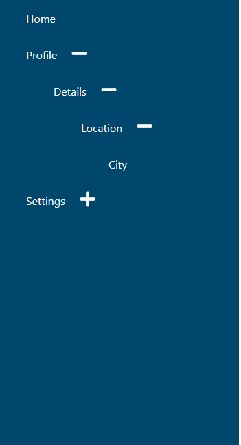
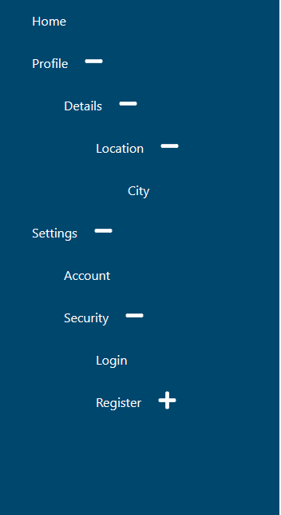

# Tree View aka Menu List or Folder View Project using react

## Description :

Tree View project uses to provide a behaviour of user Menu List or Folder View for my concern i would say vs code files tab.

Here I implemented the Tree View by using basic array of objects , That contains the Folder name and location also children array.

Basic functionality of Tree view project is UI page rendering is show plus icon if current folder have children else doesn't show . similiarly after a user clicks the + icon it expand and shows corresponding children and it's content to - helps to user can undo their action.

## Initial page :

## Expanding And Clicked Page :

##

