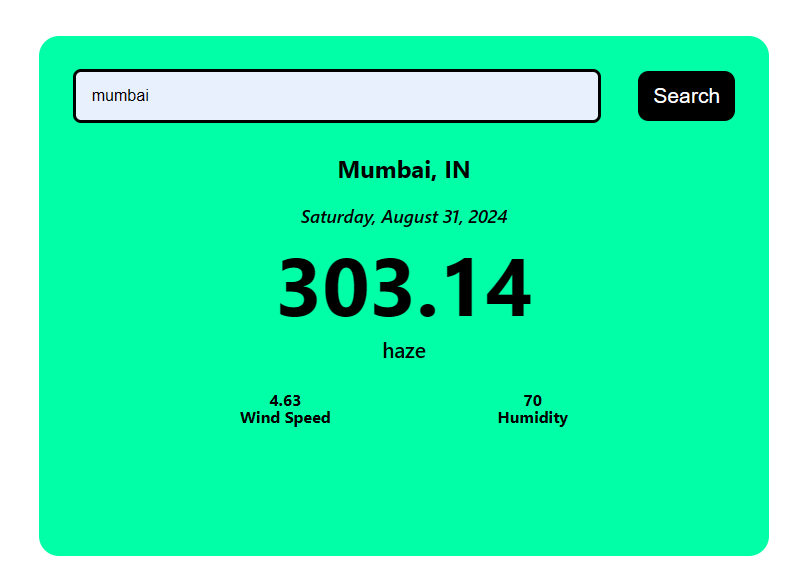

# Weather App Project using react

## Description :

Weather App project used to provide a behaviour of dynamic and realtime weather search functionality based on user typed city names.

Here I implemented the Weather App Project using business logic of parent component `WeatherApp` takses an city name as a input value then fetch the necessary details from :

> ` `https://api.openweathermap.org/data/2.5/weather?q={param}&appid={APIKEY}` `

then store these values as state value then using these weather details as current city weather details to `Weather` component.

On child component `Search` responsible for the user interaction for get the city name values then use this to provide required API call then necessary Ui page finally render it.

Whenever user types or changes city name it updates the city name state then if they clicks search it fetch corresponding city weather details with concurrent details. If user entered city doesn't appear on the api call it shows on ui invalid city name please enter correct name. Also include the loading functionality to improve user interaction

## Weather App screen shots :

